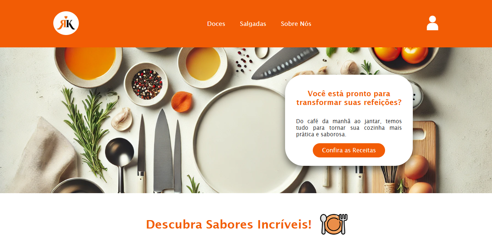

# 🍽️ ReceitasKing

Um site simples e prático para visualização de receitas culinárias. Feito com HTML, CSS e JavaScript.

## 📌 Descrição

O **ReceitasKing** tem como objetivo apresentar receitas de forma visual e acessível, com imagens e informações essenciais para quem deseja cozinhar com praticidade.

## 🚀 Funcionalidades

- Página principal com visual atraente
- Espaço para exibição de receitas com imagem.
- Estrutura pronta para futuras implementações, como:
  - Filtro por categorias
  - Busca por nome de receita
  - Cadastro de novas receitas

## 🛠️ Tecnologias Utilizadas

- HTML5
- CSS3
- JavaScript

## 📂 Estrutura do Projeto
ReceitasKing/
├── index.html # Página principal
├── style.css # Estilos principais
├── /img # Imagens usadas no site
├── /css # CSS adicional
└── /js # Scripts JavaScript

## 📷 Captura de Tela

#👨‍💻 Autor
Desenvolvido por Nicolas Moreira Lima do Nascimento
